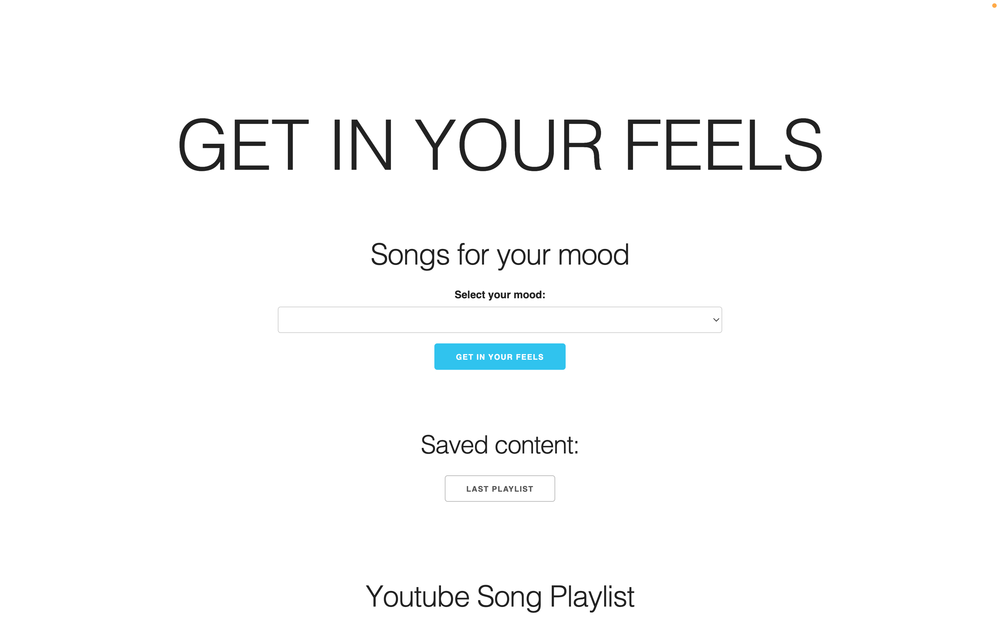
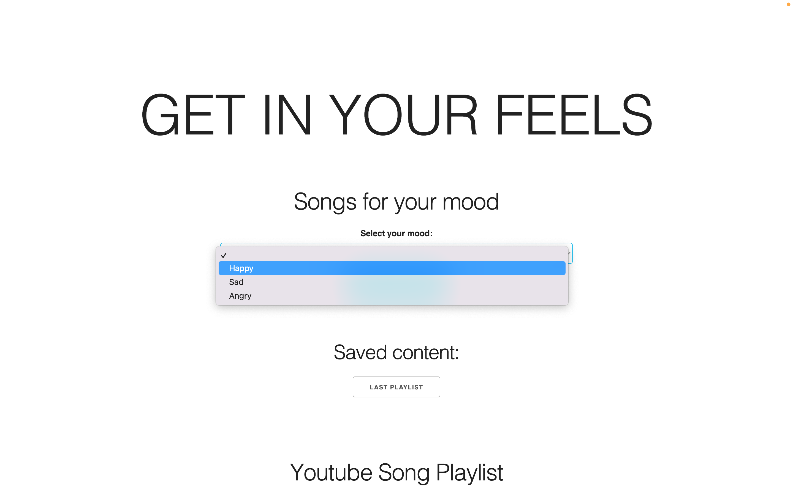
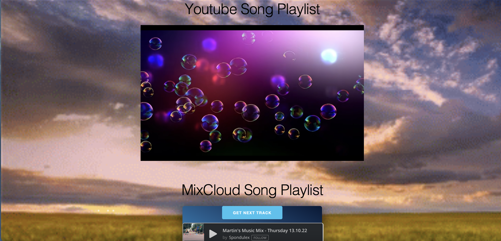
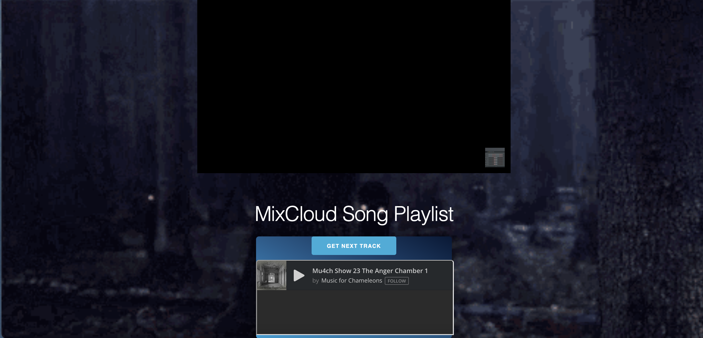
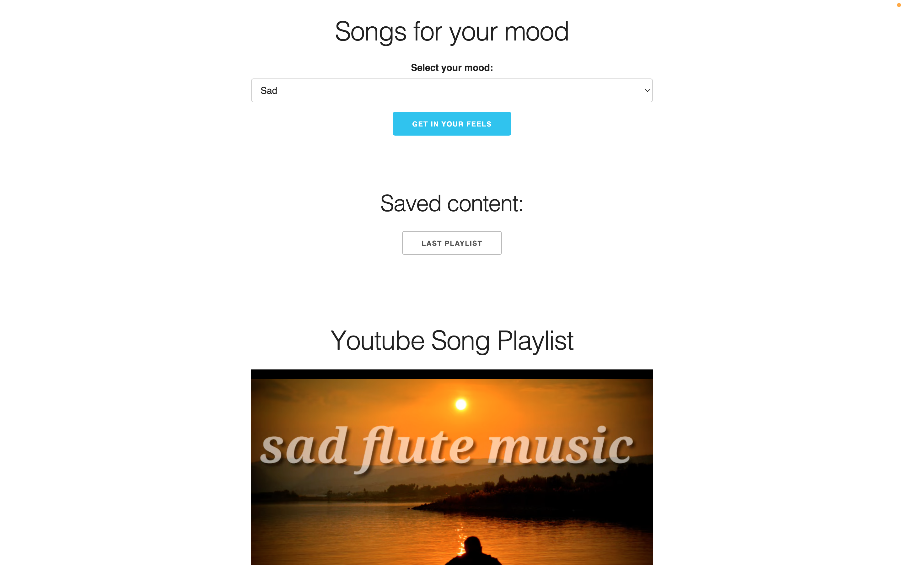

# in-my-feels
An app that suggests song options based on a mood that a user enters or selects.

# Project 1: Get In Your Feels

## Description

User Story:
- AS A moody user, I WANT TO be able to select from a list (or enter keywords) that match my mood, as be presented with a list of music, video, and movie suggestions I can choose from SO THAT I can get my groove on.
- AS A User, when I am presented with a selection of music, I WANT TO be able to play the selection as a playlist, SO THAT I can listen to the music for an extended period of time while I'm doing other things

Project #1 challenged our group to create a website that adhered to the following acceptance criteria:

- Use a CSS framework other than Bootstrap.
    - Our project utilizes a simple style guide called Skeleton, source below.

- Be deployed to GitHub Pages.
    - Out project is deployed to the following link: https://iseanc.github.io/in-my-feels/
    
- Be interactive (in other words, accept and respond to user input).
    - This website is interactive in that it asks the user to select a "mood" from the dropdown menu, after which it will produce random song playlists related to that mood. The content is produced by utilizing a keyword search to request the content in both the Youtube and Mixcloud APIs.

- Use at least two server-side APIsLinks to an external site.
    - Youtube API appears as a video player
    - Mixcloud API appears as a widget song player

- Use client-side storage to store persistent data.
    - Under the section "Saved Content:" you will see a "Last Playlist" button populate after each search, this will save the previous Youtube playlist populated and play it again.

- Be responsive.
    - You will see that the webpage is responsive for smaller screens, adjusting in size.

- Have a polished UI.
    - The UI is clean, and demonstrates the desired content in an organized manner.

- Have a clean repository that meets quality coding standards (file structure, naming conventions, best practices for class/id naming conventions, indentation, quality comments, and so on).
    - You will see that the repository has the appropriate file structure, that multiple branches were committed for various features by various group members.
    - The index, javascript and css are appropriately formatted and easily read, there are comments throughout explaining the code

- Have a quality README (including a unique name, description, technologies used, screenshot, and link to the deployed application).
    - Refer to this document

- Provide a short description explaining the what, why, and how of your project.
    - What: An app that suggests multiple song options based on a mood that a user enters or selects
    - Why: As a user, I want to be presented with random songs related to my current mood so that I can be entertained
    - How: Using 2 APIs (Youtube, Mixcloud) that produce the random song playlists

## Installation

1. The first step was to set up the HTML with the following containers:
    - A form with a dropdown menu for mood options to select from, and a button with an event listener to generate the content.
    - A div and button for the "saved content" where local storage will be saved when the mood is submitted.
    - A div to hold the Youtube player, and a div to hold the MixCloud widget

2. Variables were created to hold the following: mood form, submit button, Youtube playlist, and MixCloud playlist. There was a variable created to hold the Youtube API key, as well as various video parameters that acted as filters for the requested Youtube content (so that no copyright videos would be displayed, and no broken links).

3. An empty array was created each for the random videos to be generated by Youtube API, the MixCloud songs, and an empty array to hold old playlists for local storage.

4. The event listener attached to the mood selection submit button calls the function that will generate the random Youtube video content related to the mood as well as the MixCloud widget.

5. The Youtube content generator function uses fetch to request the Youtube data, we request 10 random videos related to the mood keyword, and then randomize them into an array (or playlist) to be played for the user. The songs are played in a playlist format. The videos are displayed using the Youtube API video player.

6. The "Last Playlist" button holds the identical array of the playlist of videos to local storage. It will start your last Youtube playlist from the top.

7. Installation for MixCloud widget API:
    - We used the Mixcloud Widget embedded on the web page in an iFrame.
    - After fetching JSON content from the Mixcloud API, we used path portion of the returned URLs pointing to specific content to change the URL that the Widget loads.
    - We did not see how the Mixcloud widget supports playlists, so we added a second button (Get Next Track) to allow the user to cycle through an array of the search results returned from Mixcloud.
    - In order to change the track loaded in the widget, it was necessary to remove the widget from the webpage, change the URL, and the re-append the widget.

8. Attempts were made to fetch the OMDB API to return movie title suggestions, however we were ultimately unable to fetch the content in a way that would display the recommendation. Our original plan was to pull random videos, songs and movie titles related to the seleted mood.

## Usage

To use the webpage, you will click the dropdown menu under "Select yoour mood" and select a mood. Then you will submit on the button "Get In Your Feels."

You will see a random Youtube playlist populate that is related to that selected mood. You will also see a random song playlist populate from MixCloud with mood-related songs.

You can click on the Youtube video or song widget to play either content. You can also advance to the next Youtube video or next song in the MixCloud playlist (click "Get Next Track") in each playlist to get another mood-related song. The Youtube playlist holds 10 songs, and the song widget holds a random amount of songs.

You can access your last Youtube playlist by clicking on the "Last Playlist" button that appears under "Saved content." Then you will be presented with your last search, starting the playlist from the top.

If you want another random playlist in your pre-selected mood or new mood, simply select a new mood from the dropdwon list and click "Get In Your Feels" and you will see another completely random playlist generated.

## Credits

Collaborators: 
- Sean Collins: Youtube API, MixCloud API
- Miguel Carrillo: Youtube API, Skelton/CSS styling
- Margaret Delaney: Youtube API, HTML, Skeleton/CSS stlying
- Kellen Kittrell: OMDB API
- Annemarie Sheridan: finding resources, research

Sources:
- Youtube API: https://developers.google.com/youtube/v3/quickstart/js
    - Code for embedded video player: https://developers.google.com/youtube/iframe_api_reference
- MixCloud API: https://www.mixcloud.com/developers/
- OMDB API: https://www.omdbapi.com/
- Skeleton CSS Styling: http://getskeleton.com/#grid

## License

MIT License

Copyright (c) 2022 maggierdelaney

Permission is hereby granted, free of charge, to any person obtaining a copy
of this software and associated documentation files (the "Software"), to deal
in the Software without restriction, including without limitation the rights
to use, copy, modify, merge, publish, distribute, sublicense, and/or sell
copies of the Software, and to permit persons to whom the Software is
furnished to do so, subject to the following conditions:

The above copyright notice and this permission notice shall be included in all
copies or substantial portions of the Software.

THE SOFTWARE IS PROVIDED "AS IS", WITHOUT WARRANTY OF ANY KIND, EXPRESS OR
IMPLIED, INCLUDING BUT NOT LIMITED TO THE WARRANTIES OF MERCHANTABILITY,
FITNESS FOR A PARTICULAR PURPOSE AND NONINFRINGEMENT. IN NO EVENT SHALL THE
AUTHORS OR COPYRIGHT HOLDERS BE LIABLE FOR ANY CLAIM, DAMAGES OR OTHER
LIABILITY, WHETHER IN AN ACTION OF CONTRACT, TORT OR OTHERWISE, ARISING FROM,
OUT OF OR IN CONNECTION WITH THE SOFTWARE OR THE USE OR OTHER DEALINGS IN THE
SOFTWARE.